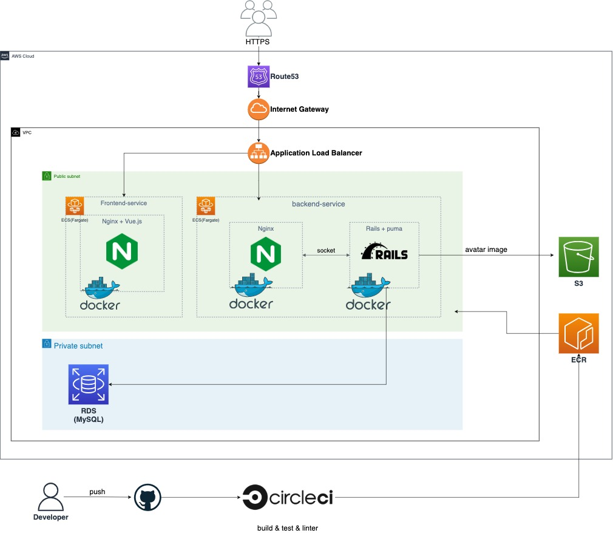
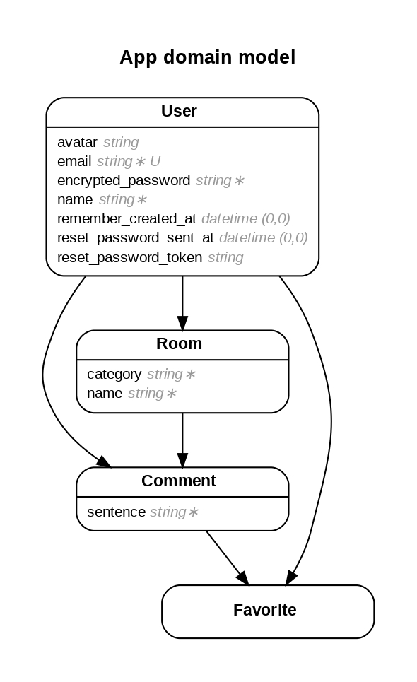

# Freechannel
部屋を作りその部屋ごとにチャットができるアプリです。
部屋ごとにカテゴリーを設けて好きな話題でチャットしてください。
レスポンシブ対応しているのでスマホからでも閲覧いただけます。

## URL
https://freechannel.link

## 機能一覧
- SPA
- ユーザー登録機能・ログイン機能(devise)
- 部屋作成機能
- 画像投稿機能(carrierwave, fog, S3)
- リアルタイムチャット機能(ActionCable)
- コメントいいね機能(Ajax)
- ページネーション機能(kaminari, vuetify)
- 部屋検索機能

## 使用技術
- Git
- CircleCI
- Docker / Docker-Compose
- AWS
  - VPC
  - ECS (Fargate)
  - ECR
  - S3
  - RDS
  - Route53
  - ALB
- バックエンド
  - Nginx
  - Mysql 8.0
  - Ruby 3.0.2
  - Rails (APIモード) 6.0.4
  - ActionCable
  - Puma
  - Rspec
  - Rubocop
- フロントエンド
  - Nginx
  - JavaScript
  - Vue.js 2.6
  - VueRouter
  - Vuex
  - Axios
  - Vuetify
  - Cypress
  - Jest
  - Eslint

## AWSインフラ構成図

## ER図

## テスト
- バックエンド
  - RSpec
    - 単体テスト(model, channel)
    - 機能テスト(request)
- フロントエンド
  - Jest
    - ユニットテスト(view, component)
  - Cypress
    - E2Eテスト
